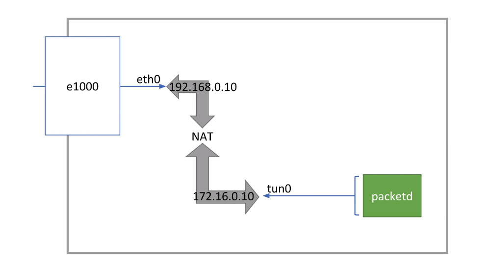

### O que eu aprendi hoje?

# Java é "container aware"

A partir do Java 11 e versões posteriores da JDK quando uma aplicação Java roda em container a JVM sabe que isso está acontecendo e tomar decisões baseadas nisso. Um efeito colateral disso é no caso do ECS onde quando é definido nível de CPU à nível de task pode ser que o container rodando o processo da JVM fiquei limitado a quantidade de CPU definida lá mesmo que o host tenha CPU sobrando, isso acontece por conta da aplicação estão ciente que roda em um container com configurações de CPU limitadas.

# Interfaces de rede

Normalmente a interface de rede padrão é a eth0. Uma mesma interface de rede pode responder para mais de um endereço, normalmente os endereços estão em subenets diferentes. Por exemplo, é possível que a interface de rede eth0 tenha dois endereços 192.168.0.10 e 172.16.0.10 e ao executar comando como bind("*:80") o servidor irá escutar nos dois endereços, mas os pacotes chegam no mesma interface. A eth0 geralmente é traduzida pela placa de rede da máquina que faz a tradução do meio físico do hardware pro software.

Uma interface de rede é uma entidade lógica que permite o sistema se conectar a uma rede podendo representar uma conexão física ou virtual. Após criar uma interface de rede ela representa uma conexão entre o sistema e uma rede física ou virtual podendo ter um endereço de IP, uma máscara de sub-rede, um gateway padrão e outras configurações de rede.

O mais comum é separar redes em diferentes interfaces de rede. É possível ter interfaces de rede que são somente virtuais e não diretamente ligadas a uma placa de rede física, são interfaces de rede mantidas por processos do usuário dentro do sistema operacional. 

Uma forma de uma interface de rede virtual se comunicar com o mundo externo (internet) é através do NAT. 

Nesse exemplo existe uma interface de rede virtual tun0 suportada por um processo do usuário com um endereço 172.16.0.10 que tem um NAT que traduz para o IP 192.168.0.10 que por sua vez representa a interface de rede padrão desse diagrama que contém uma placa de rede física e sabe como se comunicar com a internet. Nesse caso quando um pacote é enviado pela interface tun0 o pacote é "rescrito" com o IP da interface eth0.

Pensando em um host básico com uma placa de rede, uma interface e uma rede somente: 

- O host irá ter um endereço de rede privado
- Dentro da rede existe um modem (access point) com um endereço privado

Quando um pacote é enviado partindo do host seguimos: 

1. Pacote sai partindo com o endereço privado do host
2. A requisição é externa pra fora da rede então vai pro gateway a partir de um IP privado que representa o modem
3. A informação é passada através da placa de rede conectada entre o host e o access point
4. O access point através do NAT traduz o IP privado da rede para um IP público do provedor de internet

Apesar de endereços MAC serem definidos à nível de hardware é possível que uma interface de rede virtual tenha um endereço MAC.

# MAC e IP

Endereços MAC são utilizados primariamente para comunicação local (Layer 2) de uma LAN, normalmente entre dispositivos conectados por um switch. Quando falamos de IP (Layer 3) normalmente são comunicações externas como a internet. 