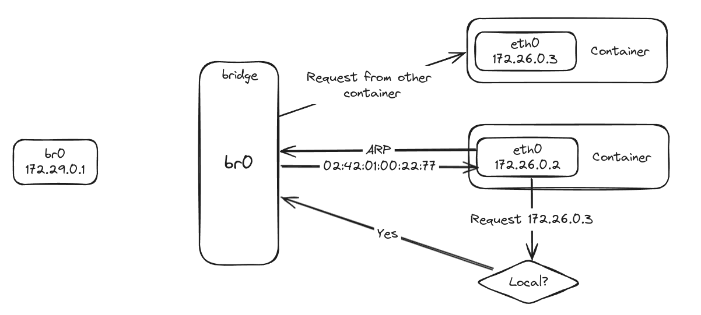

### O que eu aprendi hoje?

# Linux bridges

Uma bridge no Linux é um módulo do Kernel  que funciona como um switch encaminhando pacotes entre interfaces que conectam nela. Normalmente é utilizado para direcionar pacotes de rede em roteadores, gateways ou entre máquinas virtuais e redes dentro da máquina host.

Podemos criar uma bridge utilizando:

<pre>
ip link add br0 type bridge
ip -j -p -d link show br0
</pre>

Note que ao criar uma bridge ao rodar `ifconfig` não foi criado nenhuma interface de rede ainda.

Sendo a bridge como um "switch" virtual ele possui apenas um endereço MAC e não IP.

É possível visualizar quais bridges foram criadas no Linux através de: 

<pre>brctl show</pre>

Quandro criamos um bridge no Linux (br0) a "bridge port" que contém o IP tem o mesmo nome (br0)

# Tunneling e tun/tap