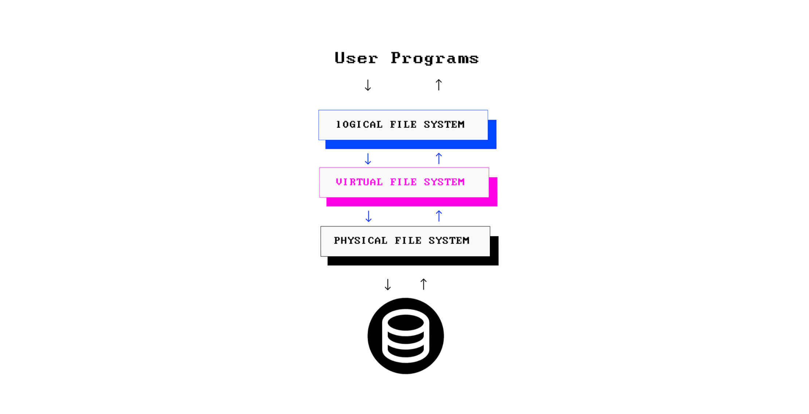

# Filesystems 

- Physical layer: implementação concreta do sistema de arquivos, resposável pelo gerenciamento de espaço no dispositivo de armazenamento relativo a partição. 
- Virtual layer (vfs): provém uma visualização consistente de vários sistemas de arquivos que residem no mesmo sistema operacional. Essa camada define um contrato que todas camadas físicas dos sistemas de arquvivo devem ter implementadas para suportar no sistema operacional. 
- Logical layer: é a parte que o usuário interage de forma mais direta, provém um API permitindo o usuário interagir com o sistema de arquivos como comandos de OPEN, READ e WRITE. 

Metadados de arquivos em Linux são chamados de `inodes` e são armazenados separadamente do arquivo. Cada arquivo possui um `inode number` que identifica o arquivo assim como indica em qual bloco está armazenado no dispositivo. 

# Arquivos ELF 

Arquivos ELF (Executable and Linkable Format) são um tipo comum utilizado para representar arquivos executáveis que geralmente são conhecidos como binários. 

Essa distinção é importante para o SO saber como deve tratar um arquivo. Por exemplo, ao rodar o commando `xxd file.txt` será exibido a sequência de bytes contidas no arquivo e uma tradução de cada byte para um formato conhecido como o ASCII. Agora ao rodar o comando `xxd file.o` teremos uma mudança, primeiro terá um header indicando o tipo do arquivo como ELF e uma sequência de metadados e em seguida bytes que representam o código de máquina obtido pelo assembler durante o processo de compilação do código fonte. 

# pprof 

É uma ferramenta utilizada para visualizar e analisar dados de perfomance da aplicação num geral.

# Como um arquivo pode ser separado em vários arquivos menores no Linux

