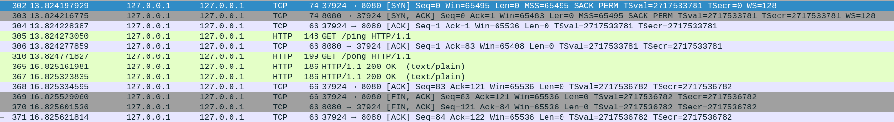

# Como proxy server de Go funciona 

Em Go existe um objeto utilitário para funcionar como um proxy reverso. Podemos utiliza-lo para redirecionar um endpoint para outro em um servidor diferente. 

<pre>
targetServerUrl, _ := url.Parse("localhost:8081")
httputil.NewSingleHostReverseProxy(targetServerUrl) 

http.HandleFunc("/ping", func(w http.ResponseWriter, r *http Request) {
    log.Default().Println("Hit /ping on :8080")
    proxy.ServeHTTP(w, r)
    log.Default().Print("Finished")
})
</pre>

Ou seja, toda vez que chegar uma requisição :8080/ping sera redirecionado pelo proxy para :8081/ping. Podemos ver isso acontecendo no wireshark. Basicamente chega a requisição na :8080/ping, é feita uma outra requisição HTTP pra :8081/ping e assim que obtida a resposta é retornado pro cliente a resposta de :8081/ping.

# Go context 

Go fornece um pacote chamado `context` utilizado para propagar valores, cancelamentos e até cancelamentos com prazo. Todo `context` tem uma "raiz" (root) geralmente partindo de `context.Background()`, podemos utilizar `context` para cancelar uma execução se certa ação for cumprida. Existem três "tipos" princiais de channel:

- WithTimeout: pode ser utilizado para realizar opções demoradas e ter um tipo de timeout para cancelar uma execução
- WithDeadline: semelhante ao timeout, mas com opções mais flexíveis para definir o tempo
- WithValue: para propagar um valor pra frente

Exemplo de uso com WithTimeout: 

<pre>
func main() {
	ctx := context.Background()
	ctx, cancel := context.WithTimeout(ctx, time.Second)
	defer cancel()
	HandleContext(ctx, time.Second*5, "Hello World")
}

func sleepAsChannel(delay time.Duration) chan bool {
	done := make(chan bool)
	go func() {
		time.Sleep(time.Second * delay)
		done <- true
	}()
	return done
}

func HandleContext(ctx context.Context, delay time.Duration, message string) {
	select {
	case <-sleepAsChannel(time.Second):
		log.Default().Print("Finished")
	case <-ctx.Done():
		log.Default().Print(ctx.Err())
	}
}
</pre>

A ideia de utilizar WithValue para propagar um valor deve ser utilizada com cautela visto que é uma informação que fica ímplicita no fluxo. Utilizar o context para propagar um valor deve ser utilizado quando faça sentido ao longo do ciclo de vida do objeto. Como no escopo de uma requisição, faz sentido ter dentro do context da request um valor único que identifica o ID da requisição assim em vários trechos e serviços diferentes é possível ter o tracking dessa informação. Ou como no fluxo de re-tentativa de uma requisição ter no contexto o número de tentivas feitas nessa request.

# Go retornando channels de funções 

É possível em Go retornar channels assim como é possível receber como parâmetro de funções. Podemos retornar uma função com channel que indica quando determinada ação feita por essa função foi finalizada. Por exemplo: 

<pre>
func returnChannel() chan bool {
	done := make(chan bool)
	go func() {
		time.Sleep(time.Second * 5)
		done <- true
	}()
	return done
}

func main() {
    done := returnChannel()
    x := <-done
    fmt.Println("Done", x)
}
</pre>

# Go e a função `HandlerFunc`

Utilizando `http.HandlerFunc(h)` e passando esse handler para o `Server` é possível direcionar todas requisições independentemente do endpoint para a mesma função. 

# Go e tickers

Go possui na sua stdlib algumas funções para criar "tickers" que são ações executadas em tempo fixo, como por exemplo ser notificado a cada 2s como se fosse um timer. 

Um exemplo utilizando a stdlib para executar uma ação a cada 2m: 

<pre>
t := time.NewTicker(time.Minute * 2)
for range t.C {
	log.Println("Starting health check...")
	serverPool.HealthCheck()
	log.Println("Health check completed")
}
</pre>

Uma implementação rudimentar desse mesmo código seria algo assim: 

</pre>
type myTicker struct {
	timeToTick int
	period     time.Duration
	ch         chan bool
}

func NewMyTicker(delay int, period time.Duration) myTicker {
	ch := make(chan bool)
	return myTicker{
		timeToTick: delay,
		period:     period,
		ch:         ch,
	}
}

func (m myTicker) Tick() chan bool {
	go func() {
		for {
			time.Sleep(m.period * time.Duration(m.timeToTick))
			m.ch <- true
		}
	}()
	return m.ch
}
</pre>

