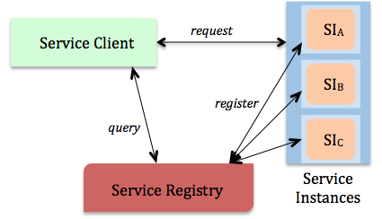
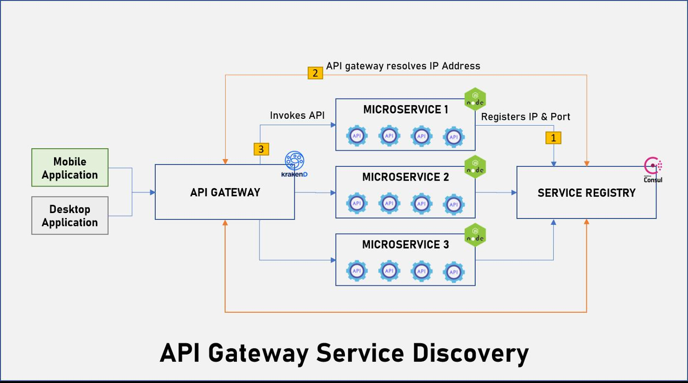

## Orquestração e coreografia de micro-serviços

Na orquestração de micro-serviços existe um componente central que centraliza o fluxo de um processo. É esse serviço central que direciona os passos de um processo para determinando micro-serviço e que no fim agrega os resultados para retornar pro cliente.

Na coreografia de micro-serviços não existe um componente central e os serviços funcionam de forma paralela através de eventos que representam uma ação que aconteceu. 

## Eventos vs comandos

- Comando: é a solicitação para que algo seja feito, pode ser síncrono, e geralmente espera uma resposta imediata. Ex.: Criar usuário, excluir pedido.
- Evento: é uma notificação de algo que aconteceu, pode ser assíncrono, e normalmente não espera uma ação imediata. Normalmente utilizados para informar outras partes do sistema sobre uma mudanlça. Ex.: Pagamento realizado, pedido cancelado.

## Camunda 

Tasks são como unidades de execução. 

Job worker é um serviço capaz de executar uma tarefa em um processo. Cada vez que um tarefa precisa ser executada essa é representada por um "job".

Um job tem as seguintes características: 

- Type: descreve uma ação e é utilizado como referência a outros jobs como collect-money
- Customer headers: metadados
- Key: chave única que identifica o job e pode ser utilizado para auditoria e identificar o resultado de execução
- Variables: informações contextuais do job em relação a regra de negócio

Por exemplo vamos supor dois serviços sequenciais: check-stock -> make-payment

Serão existentes 2 job workers requisitando um job vindo do Zeebe gateway/broker através de long polling ou outra forma de aquisição de mensagem. Assim que recebido o primeiro job check-stock pode adicionar uma informação as suas variáveis que poderão ser vistas no job seguinte. Sendo sequencial make-payment só será executado quando check-stock for bem sucedido.

Uma analogia seria o job worker ser um listener de uma fila nomeada com o type esperando consumir um mensagem (job) dentro de um fluxo.

Basicamente a workflow-engine do camunda funciona assim: 

O zeebe-workflow funciona como um orquestrador que segue as regras diagramadas pelo modelador BPMN que indica a ordem e regras de execução que define um processo. Cada serviços da nossa arquitetura implementa esses passos através de job workers que basicamente são clientes de long polling (uma forma de implementação) esperando por jobs como se fosse uma mensagem. Essa comunicação muitas das vezes se dá por gRPC. Cada passo dentro do workflow pode incrementar dados dentro da mensagem sendo enviada para o próximo passo. Internamente o zeebe-workflow utiliza o elasticsearch para registrar esses eventos e exibir visualização de processos acontecendo. 

## Consistência eventual vs Consistência forte

Consistência no contexto de sistemas distribuídos se refere a propriedade que garante que todas replicas de um serviço em um sistema tenham a mesma visualização de uma informação mesmo que distribuída em mais de uma máquina entre diferente localizações.

Read consistency: qualquer operação de leitura retorna o dado mais recente atualizado independente de qual nó a requisição foi direcionada.
Write consistency: qualquer operação de escrita em um nó é replicada para todas outras replicas garantindo que todas possuem a última versão do dado.

Naturalmente ações de consistência forte em sistema distribuídos aumentam a latência de operações e reduzem a disponibilidade de um serviço visto que normalmente exigem mais ações para garatir a consistência como coordenação adicional.

Sistemas com consistência eventual normalmente sincronizam seus dados entre replicas de forma assíncrona para ter um ganho maior de throughput. Por conta disso, os dados nem sempre estão na mesma versão em diferente replicas onde eventual usuários podem ver versões diferentes do mesmo dado enquanto ocorre a sincronização.  

## Cap theorem

O teorema CAP é sobre as implicações de sistemas distribuídos. 

CAP:

- C-consistency: qualquer informação deve estar em sua última versão independente de qual nó ela seja lida.
- A-availability: toda requisição, independente de escrita ou leitura e qual o cliente, deve ter um resposta do sistema mesmo quando nós eventualmente falham.
- P-partion: uma informação deve ser acessível mesmo em momentos de instabilidade na comunicação (rede) ou problemas de comunicação entre nós.

É praticamente impossível atingir esses três componentes simultaneamente a todo momento em uma aplicação. Normalmente um serviço dá enfâse em dois pontos do teorema CAP.

## Sagas

## Service discovery

É um serviço especializado em registrar e manter registros sobre outros serviços a fim de prover uma forma de comunicação. Nesse tipo de arquitetura normalmente existe um serviço de service discovery e *n* serviços que se registram fazendo uma requisição ao service discovery mantendo-o atualizado sobre alterações. O serviço de service discovery, baseado em seu estado de registros, sabe qual IP/porta/DNS deve retornar para comunicação entre serviços. Sendo assim quando um serviço precisa acessar outro serviço primeiro é feita uma requisição como uma "query" pro service discovery que retorna qual endereço o serviço deve utilizar para se comunicar.

## API Gateway

É um serviço centralizador que provém uma interface unificada de comunicação entre serviços. Em vez do cliente conhecer cada serviço individualmente ele conhece apenas o gateway que funciona como um proxy reverso provendo funcionalidades como load balancing, autenticação, autorização e gerenciamento de tráfego. 

Esse tipo de serviço normalmente é utilizado de forma concomitante com service discovery onde este fica acessível apenas internamente registrando os serviços e o API gateway fica acessível externamente utilizando o service discovery juntamente com suas regras de direcionamento para fazer requisições e retornar ao cliente.

## Service mesh

É uma camada de infraestrutura focada na comunicação entre serviços num geral lidando com: discovery, observabilidade, logging, autenticação etc. Os serviços não se comunicam diretamente, mas sim atráves dessa camada intermediária chamada de service mesh. Dentro do mundo do k8s essa comunicação entre micro-serviços é feita através do que é chamado de sidecard proxy/container que é basicamente um container que roda de forma concomitante ao serviço em um container dentro do mesmo pod e é ele que se comunica e direciona requisições para outros serviços.

- Sidecar proxy/data plane: responsável por lidar com o tráfego de rede entre serviços, esses serviços que normalmente são leves interceptam todo tráfego in/outbound e impoem as regras estabelecidas pelo control plane. Entre suas responsabilidades está o load balancing, monitoramento e roteamento de pacotes.
- Control plane: responsável por definir as regras e configurações definindo regras de comunicação e observabilidade. Entre suas responsabilidades está o discovery e a coleta de telemetria.

### Single/Multi tenancy

É um termo que representa um conceito, não fala sobre regras de implementação ou detalha especificamente como deve ser feito. 

Single tenancy: no contexto de software seria um que é construído/empacotado pensando em apenas um ator, uma organização, uma empresa. A infraestrutura é individual para aquele ator. Quando precisa ser adicionado outro ator, outra organização, é como se o software fosse "copiado" e isso inclui a infraestrutura para atender esse novo ator.

Multi tenancy: no contexto de software seria um que é construído pensando em suportar num mesmo código, mesma infraestutura, uma ou mais organizações, atores etc. Não significa que é obrigatório ter subdomínios, que tenha que ter um banco isolado por ator. Maioria dos serviços hoje são conceitualmente multi tenancy. 

Num conceito arquitetural de banco de dados há duas principais formas de abordar o multi tenancy.

Database-per-tenant: é um caso mais extremo onde cada organização/ator tem um banco de dados totalmente isolado.
Single Database with Tenant Identification (Row-Level Multitenancy): todos atores, chamado de tenantes, usam o mesmo banco, mas são identificados de alguma forma única como tenant id. É uma forma cotidiana de usar banco de dados.

# BFF