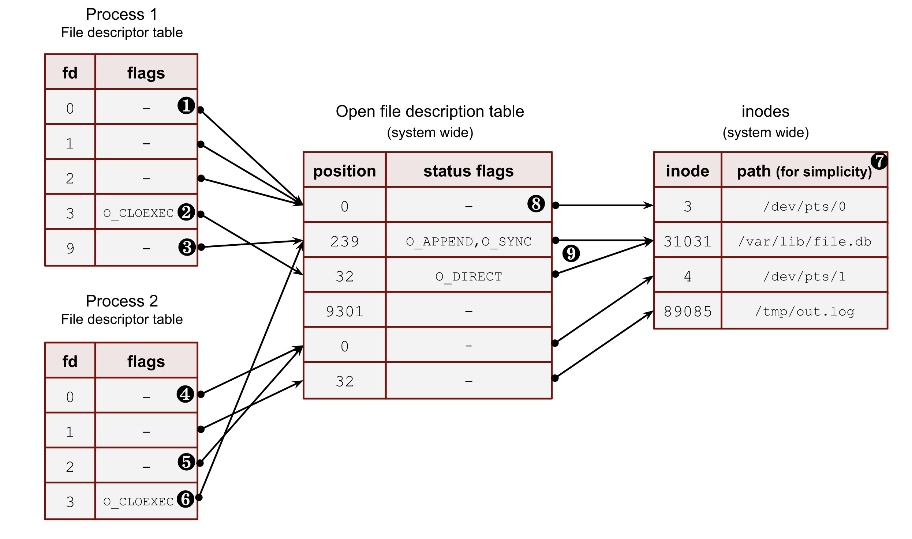
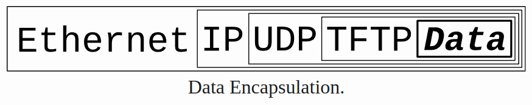

### O que é um socket? 

Uma forma de programas se comunicarem utilizando um padrão que é a comunicação através de um descritor de arquivo em sistemas Unix.

Descritor de arquivo que normalmente é chamado de *file descriptor*

Em sistemas Unix tudo é um arquivo, uma conexão de rede, uma fila, um terminal, um pipe ou um arquivo armazenado em disco.

Quando nos comunicamos com outros serviço na internet basicamente estamos interagindo com arquivos no fim das contas.

Cada processo tem sua própria tabela de descritor de arquivo que é basicamente um valor inteiro. 

Esse valor funciona como um offset que leva a uma referência que aponta pra tabela global de descritores de arquivos abertos do sistema operacional gerenciado pelo kernel.

Existem vários tipos de sockets, DARPA Internet addresses (Internet Sockets), path names on a local node (Unix Sockets), CCITT X.25 addresses.

O mais amplamente utilizado e comum são os Internet Sockets.

Existem também vários tipos de Internet Socket, mas são dois amplamente utilizado: Stream sockets (SOCK_STREAM) e Datagram Sockets (SOCK_DGRAM).

Stream sockets são uma forma eficiente de estabelecer um fluxo de dados entre duas pontas onde se vocẽ enviar um item n. 1 e um item n.2 ele será entregue na ordem correta. 

Ferramentas como telnet e ssh utilizam esse tipo de socket pois os comandos precisam chegar na ordem correta para funcionar.

HTTP também usa stream sockets.

Enquanto stream sockets utilizam TCP para uma conexão "a prova de erros" datagram sockets utilizam o protocolo UDP onde nem a entrega tão a pouco a ordem dela é garantida.

Nesse tipo de comunicação normalmente uma conexão não é estabelecida, é criado um pacote com um endereço IP de destino e é enviado em seguida. 

Apesar de protocolos como *tftp* e *dhcpcd* utilizarem UDP eles constroem seu próprio protocolo para garantir a ordem das entregas. Por exemplo, o *tftp* para cada pacote que envia espera um pacote de volta como um ACK.

### Roteamento

Agora falando sobre IP, a anotação mais comum hoje em dia é de `IP/<quantidade de bits de rede>` chamado de CIDR (Classless Inter-Domain Routing) O valor após o "/" signigica a quantidade significativa de bits na máscara de sub-rede.

Por exemplo, 

172.168.20.210/30

Para descobrir qual é a parte para rede convertemos o IP para binário e utilizamos o operador bitwise & 

10101100.10101000.00010100.11010010 & 11111111.11111111.11111111.11110000 

Temos: 172.168.20.208, sendo 32-30 = 2 temos 2^2 endereços de host então hosts válidos são: 172.168.20.208 - 172.168.20.210

Porta é um valor numérico de 16 bits utilizado pra identificar um serviço numa rede. Utilizando uma analogia, enquanto o IP seria como a rua da máquina host, a porta seria como o número. 

Se existem dois serviços, um servidor web e um serviço ssh, como seria possível saber para onde redirecionar a requisição? 

Considerando que os dois utilizam uma conexão TCP/IP o pacote chegaria no endereço de destino, mas precisaria saber se deveria ir para o servidor web ou para o serviço de ssh rodando na mesma máquina. Essa distinção é feita pela porta. 

No fim das contas a porta é utilizado pelo kernel para associar os pacotes de rede recebidos a um certo socket *(file descriptor)*.

### Recebendo dados

Dependendo da arquitetura da máquina recebendo o pacote ele pode ser processo de forma diferente. 

Algumas arquiteturas recebem os dados no modelo big-endian onde o maior valor é enviado primeiro, onde outros seguem o modelo little-endian onde é feito o contrário. 

Por exemplo, ao enviar o valor 45967 em hexadecimal b34f em big-endian seria enviado b3 e 4f enquanto no little-endian seria 4f e depois b3.

Em questão de terminologia, host byte order se refere a ordem que os bytes são processados na arquitetura de uma máquina podendo ser little-endian ou big-endiand. Enquanto network host byte padronizado para protocolos de rede utiliza big-endian.

Por causa dessa distinção entre máquinas host é necessário se preocupar em como um valor número é enviado e lido entre uma rede e outra. 

Se tratando de números de 16 de 32 bits existem as seguintes funções: 

htons()	host to network short
htonl()	host to network long
ntohs()	network to host short
ntohl()	network to host long

Por exemplo, htons() seria utilizado antes de enviar um número de 16 bits para a rede e ntohs() seria utilizado para legar um número de 16 bits vindo da rede.

### Estruturas

Um socket é um arquivo. No entanto, nem todos os arquivos têm nomes. Aqui estão alguns exemplos de arquivos que não têm nomes:

- Qualquer arquivo que costumava ter um nome e agora foi excluído, mas ainda está aberto por um programa.
- Um pipe sem nome, como aquele criado pelo operador | no shell.
- A maioria dos sockets: qualquer socket da Internet ou um socket Unix que não está no namespace do sistema de arquivos (pode estar no namespace abstrato ou sem nome).

Quando criamos um socket em um programa esse programa tem um PID associado a ele, através de `/proc/<pid>/fd` e `/proc/<pid>/fdinfo` podemos ver o nosso socket criado.

O diretório `/proc` funciona como um filesystem virtual que fornece uma interface as estruturas de dados do kernel e informações referentes ao processo rodando.

Por exemplo: 

<pre>
int main(int argc, char const *argv[])
{
    struct addrinfo hints, *result, *p;
    std::memset(&hints, 0, sizeof(hints));

    hints.ai_family = AF_UNSPEC; // IPv6 or IPv4
    hints.ai_socktype = SOCK_STREAM; // Set type of socket, in this case stream socket
    hints.ai_flags = AI_PASSIVE; // Say to get the IP from running machine

    getaddrinfo(NULL, "3490", &hints, &result);

    int sockfd = socket(result->ai_family, result->ai_socktype, result->ai_protocol);

    if (bind(sockfd, result->ai_addr, result->ai_addrlen)) {
         perror("bind");
         close(sockfd);
         return 1;
    }

    pid_t process_id = getpid();

    std::cout << "PID: " << process_id << std::endl;

    while(1) {

    }

    close(sockfd);

    return 0;
}
</pre>

Vai criar um programa e mostrar um PID em tela, acessando `/proc/<pid>/fd` temos: 

<pre>
fd
├── 0 -> /dev/pts/1
├── 1 -> /dev/pts/1
├── 2 -> /dev/pts/1
└── 3 -> socket:[215203]
</pre>

Note que 0, 1 e 2 são respectivamente o stdin, stdout e stderr enquanto 4 é o nosso socket criado.

De mesma forma em `/proc/<pid>/fdinfo` temos: 

<pre>
fdinfo
├── 0
├── 1
├── 2
└── 3
</pre>

E rodando `cat /proc/<pid>/fdinfo/3`:

<pre>
pos:	0
flags:	02
mnt_id:	9
ino:	215203
</pre>

### Conexão

Quando é estabelecida uma conexão entre um socket e outro cada conexão é individual e representado pelo descritor de arquivos. 

No loop básico por pseudo-código:

<pre>
SocketServer socketListener = listen(...)
while(true) {
    SocketConnection connection = socketListener.accept()
    // ...
}
</pre>

Vão sempre existir ao menos um descritor de arquivo aberto esperando por conexões **socketListener** e cada objeto **connection** vai ser um descritor de arquivo diferente (um socket diferente).